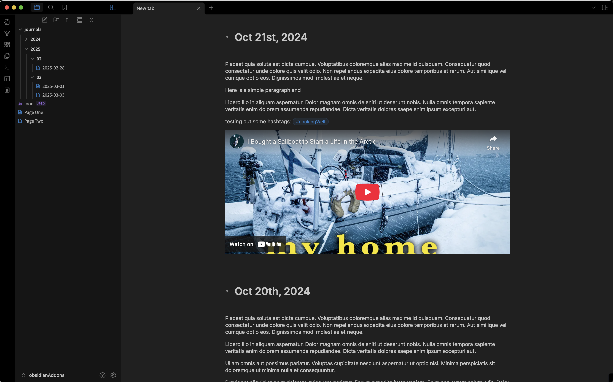
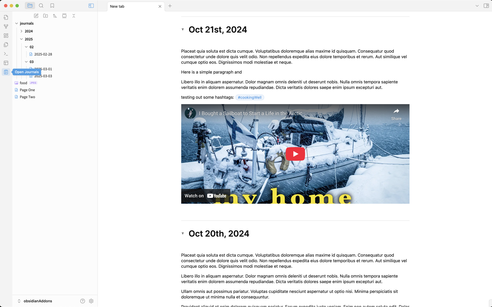
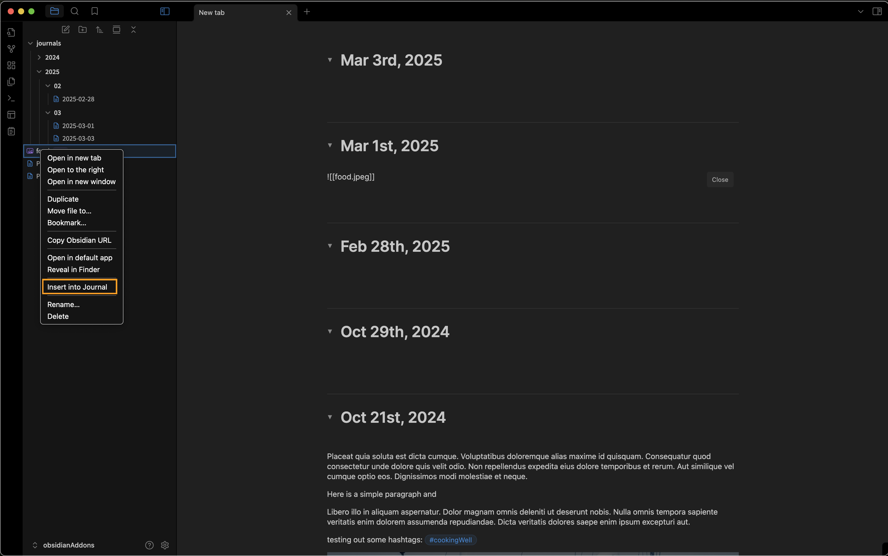
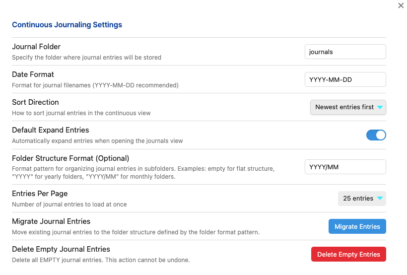

# Continuous Journaling for Obsidian

A plugin for obsidian that displays the journals in one Logseq-like continuous page.

**Screenshots:**

Insert file into journals:

Settings:

## Features

- **Continuous Journal View**: View all your daily journal entries in a single scrollable page
- **In-place Editing**: Edit journal entries directly in the continuous view
- **Dedicated Journal Folder**: Keep your journal entries organized in a dedicated folder
- **Automatic Creation**: Automatically creates today's journal entry
- **Collapsible Entries**: Easily collapse and expand entries for better navigation
- **Customizable Settings**: Configure folder location, date format, and display preferences
- **Empty Entry Management**: Easily delete all empty journal entries to keep your feed clean

## How to Use

**After installing this plugin:**

1. A new ribbon icon (notepad) is added to the left sidebar
2. Click the icon to open the continuous journal view
3. The view displays all your journal entries in one scrollable page
4. Click on an entry's content to edit it directly
5. Click on an entry's title to open it in a separate tab
6. Use the toggle button to collapse/expand entries

**Others functions:**

* Use the 'close' button or press the Esc key to close the editing mode
* Right click on any file (image, pdf, etc.) in your tree view while in editing mode, and choose 'Insert into Journal' to add the file to your journal entry

**Notes:**

* The Daily Notes core plugin isn't necessary when using continuous journaling
* The Periodic Notes community plugin uses similar folder structures and could conflict with continuous journaling

## Settings

- **Journal Folder**: Specify where journal entries are stored (default: "journals")
- **Date Format**: Format for journal filenames (default: "YYYY-MM-DD")
- **Sort Direction**: Display newest entries first or oldest entries first
- **Default Expand Entries**: Whether entries should be expanded by default
- **Folder Structure Format:** Choose how your journal pages are stored (Flat folder, YYYY or YYYY/MM)
- **Entries per Page:** choose how many entries are shown at once (10, 25 or 50)
- **Migrate your Entries:** migrate all your journal files automatically to match your settings in 'Journal Folder' and 'Folder Structure Format'
- **Delete Empty Journal Entries:** with its automated daily journal creation, there can be a lot of empty entries after a while. Delete all empty entries to clean up your feed with the click of a button.

## Installation

### From Obsidian Community Plugins

1. Open Obsidian Settings
2. Go to Community Plugins
3. Browse and search for "Continuous Journaling"
4. Click Install and then Enable

### Manual Installation

1. Download the latest release from the [GitHub repository](https://github.com/aurelien81/continuous-journaling)
2. Extract the ZIP file into your Obsidian vault's `.obsidian/plugins/` directory
3. Reload Obsidian
4. Enable the plugin in Obsidian settings

## Support

Create a [new issue on the github repository](https://github.com/aurelien81/continuous-journaling/issues) if you encounter any problem or have any questions while using this plugin.

## Credits

Developed by Aurélien Lainé and inspired by [logseq](https://logseq.com/). If you enjoy Continuous Journaling, please consider supporting me:

## License

This project is licensed under the MIT License.