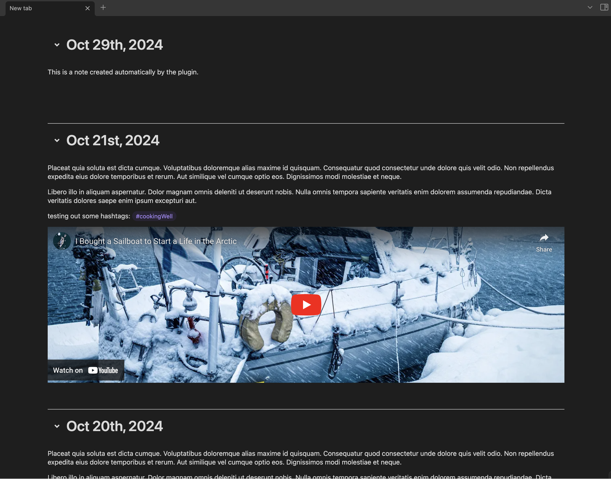
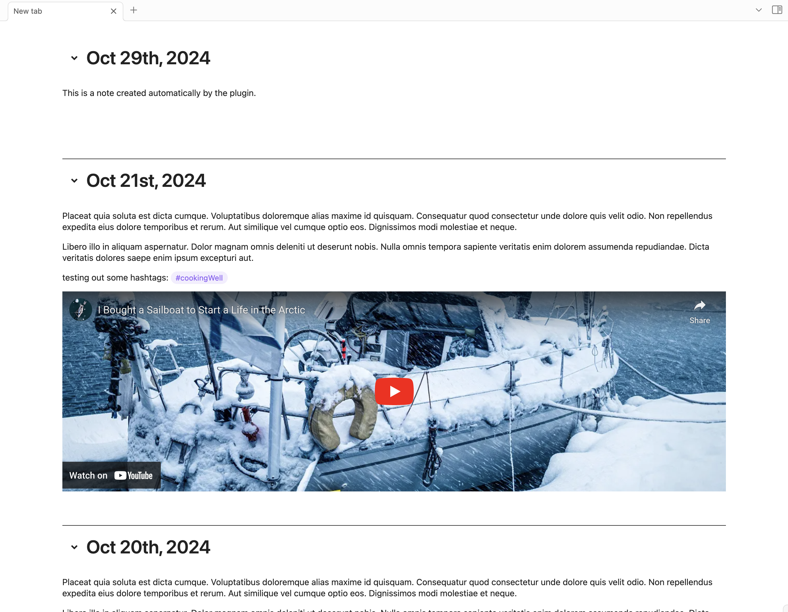

# Continuous Journaling for Obsidian

A plugin for obsidian that displays the journals in one Logseq-like continuous page.

After installing this plugin, a new item is added to the obsidian ribbon. Clicking on this item creates a new tab that displays all the daily notes into one scrollable page. The notes are editable individually, and those edits are reflected in the original notes.

Each time the journals tab is triggered, a new daily note for the day is create if that daily note doesn't already exist.

The 'Daily Notes' core plugin is not necessary for this plugin to function.

# Context
- I love the never ending journals scroll from Logseq but unfortunately, between Obsidian, Logseq, and other apps, I find myself using more apps than I want simply because each app has functions that I need for deferent types of projects. This is my first attempt at unifying those functions into one app.

- This is my first plugin for obsidian, so please be kind, I am doing my best and will continue to improve it. Make sure to raise issues if you see things that can be improved, changed, I will be happy to work on it.

# Upcoming Improvements

- Settings: choose in which the new daily note is created
- Settings: automatically create a 'journals' folder and move all current daily notes into the folder
- fix the global search when clicking on tags
- Refactoring to clean up the current code (separation of tasks, etc.)

# Say Thank You

If you are enjoying Obsidian Journaling, then please support my work and enthusiasm by buying me a book on
https://buymeacoffee.com/5svinkxxo5.

Make sure to head to [Github](https://github.com/aurelien81/obsidian-journaling) to raise issues or ask questions.

